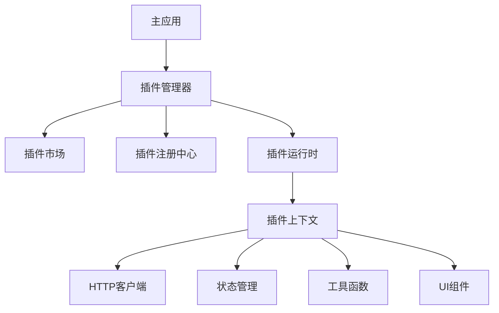

# 插件系统技术方案设计

## 1. 方案概述

### 1.1 背景
- 主应用基于 Vue2 + JavaScript 开发
- 需要支持项目定制化开发
- 插件技术栈采用 Vue3 + TypeScript
- 需要统一的插件管理机制

### 1.2 目标
- 实现插件的动态加载和卸载
- 支持标准产品功能扩展
- 支持项目定制化需求
- 提供完整的插件生命周期管理
- 确保插件和主应用的稳定交互

### 1.3 技术栈
- 主应用：Vue2 + JavaScript + Vuex + Vue Router
- 插件：Vue3 + TypeScript + Pinia
- 构建工具：Webpack5
- 包管理：npm/yarn

## 2. 系统架构

### 2.1 整体架构


### 2.2 核心模块
1. 插件管理器：负责插件的注册、加载、卸载等生命周期管理
2. 插件市场：提供插件的展示、安装、更新等功能
3. 插件运行时：提供插件运行环境和上下文
4. 插件注册中心：管理插件元数据和版本信息

## 3. 详细设计

### 3.1 插件类型定义

```typescript
// 插件类型
enum PluginType {
  STANDARD = 'standard',    // 标准插件（标品自带）
  EXTENSION = 'extension',  // 扩展插件（项目定制）
  OVERRIDE = 'override'     // 覆盖插件（重写标品功能）
}

// 插件元数据
interface PluginMeta {
  name: string;             // 插件名称
  version: string;          // 插件版本
  type: PluginType;        // 插件类型
  description: string;      // 插件描述
  author: string;          // 作者信息
  dependencies: Record<string, string>;  // 依赖项
  compatibleVersions: {    // 兼容版本范围
    min: string;
    max: string;
  };
  tags: string[];          // 插件标签
  configSchema?: Record<string, any>;  // 配置模式
  permissions?: string[];  // 权限定义
  allowMultipleInstances: boolean;     // 是否允许多实例
  priority: number;        // 加载优先级
  projectId?: string;      // 项目标识
}

// 插件实例接口
interface Plugin {
  mount(container: HTMLElement): Promise<void>;
  unmount(): Promise<void>;
  update(config: any): Promise<void>;
  exports?: Record<string, Function>;
}
```

### 3.2 插件上下文设计

```typescript
// 插件上下文接口
interface PluginContext {
  // HTTP 请求客户端
  http: {
    get: (url: string, config?: any) => Promise<any>;
    post: (url: string, data?: any, config?: any) => Promise<any>;
    put: (url: string, data?: any, config?: any) => Promise<any>;
    delete: (url: string, config?: any) => Promise<any>;
  };

  // 状态管理
  store: {
    get: (key: string) => any;
    set: (key: string, value: any) => void;
    subscribe: (key: string, callback: (value: any) => void) => () => void;
  };

  // 工具函数
  utils: {
    formatDate: (date: Date, format: string) => string;
    formatMoney: (amount: number) => string;
    // 其他工具函数
  };

  // UI 组件库
  components: Record<string, Component>;

  // 事件总线
  events: {
    emit: (event: string, data?: any) => void;
    on: (event: string, callback: (data?: any) => void) => void;
    off: (event: string, callback?: (data?: any) => void) => void;
  };

  // 用户信息和权限
  auth: {
    getCurrentUser: () => User;
    hasPermission: (permission: string) => boolean;
  };

  // 环境信息
  env: {
    mode: 'development' | 'production';
    apiBaseUrl: string;
    version: string;
  };
}
```

### 3.3 插件管理机制

```typescript
// 插件管理器
class PluginManager {
  private plugins: Map<string, Plugin> = new Map();
  private context: PluginContext;

  // 注册插件
  async registerPlugin(meta: PluginMeta): Promise<void> {
    // 验证插件兼容性
    this.validateCompatibility(meta);

    // 加载插件资源
    await this.loadPluginResources(meta);

    // 创建插件实例
    const plugin = await this.createPluginInstance(meta);

    // 存储插件实例
    this.plugins.set(meta.name, plugin);
  }

  // 卸载插件
  async uninstallPlugin(name: string): Promise<void> {
    const plugin = this.plugins.get(name);
    if (plugin) {
      await plugin.unmount();
      this.plugins.delete(name);
    }
  }

  // 更新插件
  async updatePlugin(name: string, version: string): Promise<void> {
    // 实现插件更新逻辑
  }
}
```

### 3.4 主应用集成实现

```javascript
// src/plugins/plugin-system/index.js
import Vue from 'vue';
import axios from 'axios';
import store from '@/store';
import { Message } from 'element-ui';

export class PluginSystemService {
  constructor() {
    this.plugins = new Map();
    this.pluginInstances = new Map();
    this.context = null;
  }

  // 初始化插件系统
  async init() {
    // 创建插件上下文
    this.context = await this.createPluginContext();

    // 加载已安装的插件
    await this.loadInstalledPlugins();
  }

  // 创建插件上下文
  async createPluginContext() {
    // 创建 axios 实例
    const axiosInstance = axios.create({
      baseURL: process.env.VUE_APP_API_BASE_URL,
      timeout: 10000,
    });

    // 添加请求拦截器
    axiosInstance.interceptors.request.use(config => {
      const token = store.state.user.token;
      if (token) {
        config.headers.Authorization = `Bearer ${token}`;
      }
      return config;
    });

    return {
      http: {
        get: axiosInstance.get,
        post: axiosInstance.post,
        put: axiosInstance.put,
        delete: axiosInstance.delete,
      },
      store: {
        get: key => store.state[key],
        set: (key, value) => store.commit('setValue', { key, value }),
        subscribe: (key, callback) => {
          const unsubscribe = store.subscribe((mutation, state) => {
            if (mutation.type === 'setValue' && mutation.payload.key === key) {
              callback(state[key]);
            }
          });
          return unsubscribe;
        },
      },
      utils: {
        formatDate: Vue.filter('formatDate'),
        formatMoney: Vue.filter('formatMoney'),
      },
      components: {
        Button: Vue.component('el-button'),
        Table: Vue.component('el-table'),
        Form: Vue.component('el-form'),
      },
      events: new Vue(),
      auth: {
        getCurrentUser: () => store.state.user,
        hasPermission: permission => store.getters.hasPermission(permission),
      },
      env: {
        mode: process.env.NODE_ENV,
        apiBaseUrl: process.env.VUE_APP_API_BASE_URL,
        version: process.env.VUE_APP_VERSION,
      },
    };
  }

  // 注册插件
  async registerPlugin(pluginMeta) {
    try {
      // 加载插件资源
      await this.loadPluginResources(pluginMeta);

      // 获取插件构造函数
      const PluginClass = window[`plugin_${pluginMeta.name}`];
      if (!PluginClass) {
        throw new Error(`Plugin ${pluginMeta.name} not found`);
      }

      // 创建插件实例
      const plugin = new PluginClass(this.context);
      this.plugins.set(pluginMeta.name, plugin);

      // 注册到 Vue 全局
      Vue.prototype.$plugins = Vue.prototype.$plugins || {};
      Vue.prototype.$plugins[pluginMeta.name] = plugin;

      return plugin;
    } catch (error) {
      console.error(`Failed to register plugin ${pluginMeta.name}:`, error);
      throw error;
    }
  }
}

// 创建插件系统实例
export const pluginSystem = new PluginSystemService();

// 注册到 Vue 原型
Vue.prototype.$pluginSystem = pluginSystem;
```

### 3.5 插件容器组件

```vue
<!-- src/components/plugin-container/index.vue -->
<template>
  <div class="plugin-container" ref="container">
    <div v-if="loading" class="plugin-loading">
      <el-spinner />
    </div>
    <div v-if="error" class="plugin-error">
      {{ error }}
    </div>
  </div>
</template>

<script>
export default {
  name: 'PluginContainer',

  props: {
    name: {
      type: String,
      required: true
    },
    config: {
      type: Object,
      default: () => ({})
    }
  },

  data() {
    return {
      loading: false,
      error: null,
      instance: null
    };
  },

  async mounted() {
    await this.loadPlugin();
  },

  async beforeDestroy() {
    await this.unloadPlugin();
  },

  watch: {
    config: {
      deep: true,
      async handler(newConfig) {
        if (this.instance) {
          await this.instance.update(newConfig);
        }
      }
    }
  },

  methods: {
    async loadPlugin() {
      try {
        this.loading = true;
        this.error = null;

        this.instance = await this.$pluginSystem.createPluginInstance(
          this.name,
          this.config
        );

        await this.instance.mount(this.$refs.container);
      } catch (error) {
        console.error(`Failed to load plugin ${this.name}:`, error);
        this.error = error.message;
      } finally {
        this.loading = false;
      }
    },

    async unloadPlugin() {
      if (this.instance) {
        try {
          await this.instance.unmount();
          this.instance = null;
        } catch (error) {
          console.error(`Failed to unload plugin ${this.name}:`, error);
        }
      }
    }
  }
};
</script>
```

### 3.6 插件路由注册

#### 3.6.1 插件路由定义

```typescript
// 插件路由配置接口
interface PluginRoute {
  path: string;          // 路由路径
  name?: string;         // 路由名称
  meta?: {
    title: string;       // 页面标题
    icon?: string;       // 菜单图标
    permissions?: string[]; // 权限要求
    pluginName: string;  // 插件名称
  };
  children?: PluginRoute[]; // 子路由
}

// 插件路由注册信息
interface PluginRouteConfig {
  routes: PluginRoute[];        // 路由配置
  parentPath?: string;          // 父级路由路径
  beforeEnter?: (to: Route, from: Route, next: Function) => void;
}
```

#### 3.6.2 路由管理器

```javascript
// src/plugins/plugin-system/route-manager.js
export class PluginRouteManager {
  constructor(router) {
    this.router = router;
    this.pluginRoutes = new Map();
  }

  // 注册插件路由
  async registerPluginRoutes(pluginName, routeConfig) {
    const { routes, parentPath } = routeConfig;

    const processedRoutes = this.processRoutes(pluginName, routes);
    const targetRoute = parentPath
      ? this.findRouteByPath(this.router.options.routes, parentPath)
      : null;

    if (parentPath && !targetRoute) {
      throw new Error(`Parent route ${parentPath} not found`);
    }

    this.pluginRoutes.set(pluginName, {
      routes: processedRoutes,
      parentPath
    });

    if (targetRoute) {
      targetRoute.children = targetRoute.children || [];
      targetRoute.children.push(...processedRoutes);
    } else {
      this.router.addRoutes(processedRoutes);
    }

    // 更新菜单
    store.commit('menu/ADD_PLUGIN_MENU_ITEMS', {
      pluginName,
      menuItems: this.convertRoutesToMenu(processedRoutes)
    });
  }

  // 处理路由配置
  processRoutes(pluginName, routes) {
    return routes.map(route => ({
      ...route,
      component: () => ({
        component: new Promise(async resolve => {
          await this.ensurePluginLoaded(pluginName);
          const plugin = Vue.prototype.$plugins[pluginName];
          const component = await plugin.loadComponent(route.name);
          resolve(component);
        })
      }),
      meta: {
        ...route.meta,
        pluginName
      },
      children: route.children
        ? this.processRoutes(pluginName, route.children)
        : undefined
    }));
  }
}
```

#### 3.6.3 插件路由示例

```typescript
// 插件入口文件
export default class MyPlugin implements Plugin {
  async registerRoutes() {
    const routes = {
      routes: [
        {
          path: 'my-plugin',
          name: 'MyPlugin',
          meta: {
            title: '我的插件',
            icon: 'el-icon-star',
            permissions: ['plugin:my-plugin:view']
          },
          children: [
            {
              path: 'feature1',
              name: 'MyPluginFeature1',
              meta: {
                title: '功能1',
                icon: 'el-icon-document'
              }
            }
          ]
        }
      ],
      parentPath: '/dashboard'
    };

    await this.context.router.registerPluginRoutes('my-plugin', routes);
  }
}
```

## 4. 插件开发规范

### 4.1 目录结构
```
my-plugin/
├── src/
│   ├── components/       # 插件组件
│   ├── store/           # 状态管理
│   ├── api/             # API 接口
│   ├── utils/           # 工具函数
│   ├── types/           # TypeScript 类型定义
│   ├── App.vue          # 插件入口组件
│   └── index.ts         # 插件入口文件
├── package.json         # 包信息
├── tsconfig.json        # TypeScript 配置
└── vue.config.js        # Vue 构建配置
```

### 4.2 开发规范

1. 命名规范
   - 插件名称使用小写字母，单词间用连字符分隔
   - 组件名称使用 PascalCase
   - 文件名使用 kebab-case

2. 代码规范
   - 使用 TypeScript 编写代码
   - 使用 ESLint 进行代码检查
   - 使用 Prettier 进行代码格式化

3. 组件开发
   - 使用 Composition API
   - 提供完整的类型定义
   - 编写单元测试

4. 文档规范
   - 提供完整的 README.md
   - 包含安装和使用说明
   - 提供 API 文档

## 5. 插件市场

### 5.1 功能特性
- 插件分类展示
- 版本管理
- 安装/卸载
- 配置管理
- 更新提醒

### 5.2 插件发布流程
1. 开发插件
2. 插件打包
3. 测试验证
4. 发布到插件市场
5. 版本管理
6. 更新通知

## 6. 安全性考虑

### 6.1 插件安全
- 插件代码审查
- 资源完整性校验
- 运行时隔离
- 权限控制

### 6.2 数据安全
- 数据访问控制
- 敏感信息保护
- 跨域安全

## 7. 性能优化

### 7.1 加载优化
- 插件资源按需加载
- 资源缓存策略
- 并行加载优化

### 7.2 运行时优化
- 内存管理
- 插件预加载
- 懒加载策略

## 8. 部署和运维

### 8.1 部署策略
- 插件单独部署
- 版本控制
- 回滚机制

### 8.2 监控告警
- 插件运行状态监控
- 错误日志收集
- 性能指标统计

## 9. 开发流程

### 9.1 插件开发流程
1. 创建插件项目
2. 开发功能
3. 本地测试
4. 打包构建
5. 提交审核
6. 发布上线

### 9.2 版本发布流程
1. 版本规划
2. 开发与测试
3. 预发布验证
4. 正式发布
5. 监控运行

## 10. 注意事项

### 10.1 开发注意事项
- 遵循插件开发规范
- 注意版本兼容性
- 做好错误处理
- 优化加载性能

### 10.2 运维注意事项
- 定期检查插件状态
- 及时更新版本
- 做好监控告警
- 保持文档更新

## 11. 后续规划

### 11.1 近期计划
- 完善插件市场功能
- 优化插件管理机制
- 提供更多开发工具

### 11.2 长期规划
- 支持更多插件类型
- 提供更多集成能力
- 优化开发体验

## 12. 插件开发和调试

### 12.1 开发环境搭建

#### 12.1.1 插件开发模板
```bash
# 插件项目模板结构
my-plugin/
├── .vscode/                    # VSCode 配置
│   └── launch.json            # 调试配置
├── src/
│   ├── components/            # 组件目录
│   ├── views/                 # 页面目录
│   ├── store/                 # 状态管理
│   ├── api/                   # API 接口
│   ├── App.vue               # 插件入口组件
│   └── index.ts              # 插件入口文件
├── dev/                       # 开发环境配置
│   ├── main.ts               # 开发环境入口
│   └── App.vue               # 开发环境根组件
├── package.json              # 项目配置
├── vite.config.ts            # Vite 配置
└── tsconfig.json             # TypeScript 配置
```

#### 12.1.2 开发环境配置
```typescript
// vite.config.ts
import { defineConfig } from 'vite';
import vue from '@vitejs/plugin-vue';
import { resolve } from 'path';

export default defineConfig({
  plugins: [vue()],
  build: {
    lib: {
      entry: resolve(__dirname, 'src/index.ts'),
      name: 'MyPlugin',
      fileName: (format) => `my-plugin.${format}.js`
    },
    rollupOptions: {
      external: ['vue'],
      output: {
        globals: {
          vue: 'Vue'
        }
      }
    }
  },
  server: {
    proxy: {
      '/api': {
        target: 'http://localhost:3000',
        changeOrigin: true
      }
    }
  }
});
```

### 12.2 开发模式

#### 12.2.1 独立开发模式
```typescript
// dev/main.ts
import { createApp } from 'vue';
import App from './App.vue';
import { createPluginContext } from './mock-context';

// 创建模拟的插件上下文
const context = createPluginContext();

// 创建开发环境应用
const app = createApp(App);

// 注入模拟的插件上下文
app.provide('pluginContext', context);

app.mount('#app');
```

```typescript
// dev/mock-context.ts
import axios from 'axios';
import { reactive } from 'vue';

// 模拟插件上下文
export function createPluginContext() {
  const store = reactive({
    state: {},
    subscribers: new Map()
  });

  return {
    http: axios.create({
      baseURL: '/api'
    }),
    store: {
      get: (key: string) => store.state[key],
      set: (key: string, value: any) => {
        store.state[key] = value;
        store.subscribers.get(key)?.forEach(cb => cb(value));
      },
      subscribe: (key: string, callback: Function) => {
        if (!store.subscribers.has(key)) {
          store.subscribers.set(key, new Set());
        }
        store.subscribers.get(key).add(callback);
        return () => {
          store.subscribers.get(key).delete(callback);
        };
      }
    },
    // 模拟其他上下文功能...
  };
}
```

#### 12.2.2 主应用联调模式
```javascript
// 主应用开发配置 vue.config.js
module.exports = {
  configureWebpack: {
    resolve: {
      alias: {
        // 开发时将插件指向本地开发目录
        '@plugins/my-plugin': path.resolve(__dirname, '../my-plugin/src')
      }
    }
  },
  devServer: {
    proxy: {
      '/api': {
        target: 'http://localhost:3000',
        changeOrigin: true
      }
    }
  }
};
```

### 12.3 调试方法

#### 12.3.1 开发工具配置
```json
// .vscode/launch.json
{
  "version": "0.2.0",
  "configurations": [
    {
      "type": "chrome",
      "request": "launch",
      "name": "独立调试插件",
      "url": "http://localhost:3000",
      "webRoot": "${workspaceFolder}/src",
      "sourceMapPathOverrides": {
        "webpack:///src/*": "${webRoot}/*"
      }
    },
    {
      "type": "chrome",
      "request": "launch",
      "name": "主应用联调",
      "url": "http://localhost:8080",
      "webRoot": "${workspaceFolder}/src",
      "sourceMapPathOverrides": {
        "webpack:///src/*": "${webRoot}/*"
      }
    }
  ]
}
```

#### 12.3.2 调试命令
```json
// package.json
{
  "scripts": {
    "dev": "vite",
    "dev:main": "vite build --watch",
    "build": "vite build",
    "preview": "vite preview",
    "test": "vitest",
    "lint": "eslint src",
    "type-check": "vue-tsc --noEmit"
  }
}
```

### 12.4 测试方案

#### 12.4.1 单元测试
```typescript
// tests/components/MyComponent.spec.ts
import { mount } from '@vue/test-utils';
import { describe, it, expect } from 'vitest';
import MyComponent from '@/components/MyComponent.vue';
import { createPluginContext } from '../mock-context';

describe('MyComponent', () => {
  it('renders correctly', () => {
    const wrapper = mount(MyComponent, {
      global: {
        provide: {
          pluginContext: createPluginContext()
        }
      }
    });
    expect(wrapper.html()).toMatchSnapshot();
  });

  it('handles user interaction', async () => {
    const wrapper = mount(MyComponent);
    await wrapper.find('button').trigger('click');
    expect(wrapper.emitted('click')).toBeTruthy();
  });
});
```

#### 12.4.2 集成测试
```typescript
// tests/integration/plugin.spec.ts
import { mount } from '@vue/test-utils';
import { createApp } from 'vue';
import MyPlugin from '@/index';
import { createPluginContext } from '../mock-context';

describe('Plugin Integration', () => {
  it('registers and mounts successfully', async () => {
    const context = createPluginContext();
    const plugin = new MyPlugin(context);

    const container = document.createElement('div');
    await plugin.mount(container);

    expect(container.innerHTML).not.toBe('');
  });

  it('handles lifecycle correctly', async () => {
    const context = createPluginContext();
    const plugin = new MyPlugin(context);

    const container = document.createElement('div');
    await plugin.mount(container);
    await plugin.update({ theme: 'dark' });
    await plugin.unmount();

    expect(container.innerHTML).toBe('');
  });
});
```

### 12.5 开发工具链

#### 12.5.1 命令行工具
```typescript
// tools/cli.ts
#!/usr/bin/env node
import { Command } from 'commander';
import { createPlugin, buildPlugin, devPlugin } from './commands';

const program = new Command();

program
  .command('create <name>')
  .description('创建新插件项目')
  .action(createPlugin);

program
  .command('dev')
  .description('启动开发服务器')
  .option('-m, --mode <mode>', '开发模式：独立或联调', 'standalone')
  .action(devPlugin);

program
  .command('build')
  .description('构建插件')
  .option('-w, --watch', '监听模式')
  .action(buildPlugin);

program.parse(process.argv);
```

#### 12.5.2 开发辅助工具
```typescript
// tools/dev-helper.ts
export class PluginDevHelper {
  // 热重载支持
  static setupHMR(plugin) {
    if (import.meta.hot) {
      import.meta.hot.accept(['./App.vue'], ([newApp]) => {
        plugin.update({ component: newApp.default });
      });
    }
  }

  // 开发时状态持久化
  static setupStatePersistence(store) {
    const savedState = localStorage.getItem('plugin_dev_state');
    if (savedState) {
      store.replaceState(JSON.parse(savedState));
    }

    store.subscribe((mutation, state) => {
      localStorage.setItem('plugin_dev_state', JSON.stringify(state));
    });
  }

  // 开发时请求模拟
  static setupMockRequests(context) {
    const originalHttp = context.http;
    context.http = new Proxy(originalHttp, {
      get(target, prop) {
        const method = target[prop];
        return async (...args) => {
          if (process.env.NODE_ENV === 'development') {
            // 检查是否有对应的 mock 数据
            const mockData = await import(`../mocks/${args[0]}.json`);
            if (mockData) {
              return Promise.resolve(mockData);
            }
          }
          return method.apply(target, args);
        };
      }
    });
  }
}
```

### 12.6 调试技巧

1. 使用 Vue Devtools
   - 安装 Vue Devtools 的 beta 版本（支持 Vue 3）
   - 在开发模式下自动启用 devtools 支持
   - 可以查看组件结构、状态变化等

2. 日志管理
   ```typescript
   // utils/logger.ts
   export class PluginLogger {
     static debug(message: string, ...args: any[]) {
       if (process.env.NODE_ENV === 'development') {
         console.log(`[Plugin Debug] ${message}`, ...args);
       }
     }

     static error(error: Error) {
       console.error(`[Plugin Error] ${error.message}`);
       // 可以添加错误上报逻辑
     }
   }
   ```

3. 性能分析
   ```typescript
   // utils/performance.ts
   export class PluginPerformance {
     static measure(name: string, fn: Function) {
       if (process.env.NODE_ENV === 'development') {
         console.time(`[Plugin Performance] ${name}`);
         const result = fn();
         console.timeEnd(`[Plugin Performance] ${name}`);
         return result;
       }
       return fn();
     }
   }
   ```

4. 状态快照
   ```typescript
   // utils/state-snapshot.ts
   export class StateSnapshot {
     static take(store) {
       return JSON.stringify(store.state);
     }

     static restore(store, snapshot) {
       store.replaceState(JSON.parse(snapshot));
     }
   }
   ```

### 12.7 开发最佳实践

1. 开发流程
   - 使用独立开发模式快速迭代功能
   - 定期在主应用中进行联调测试
   - 保持良好的测试覆盖率
   - 使用 TypeScript 确保类型安全

2. 调试技巧
   - 善用断点和日志
   - 使用 Vue Devtools 分析组件
   - 注意性能监控
   - 保持错误边界处理

3. 代码组织
   - 遵循模块化原则
   - 保持组件粒度合适
   - 使用类型定义确保接口一致性
   - 编写完整的单元测试

4. 发布检查
   - 完整的测试用例
   - 类型检查通过
   - 代码风格检查
   - 构建产物验证
